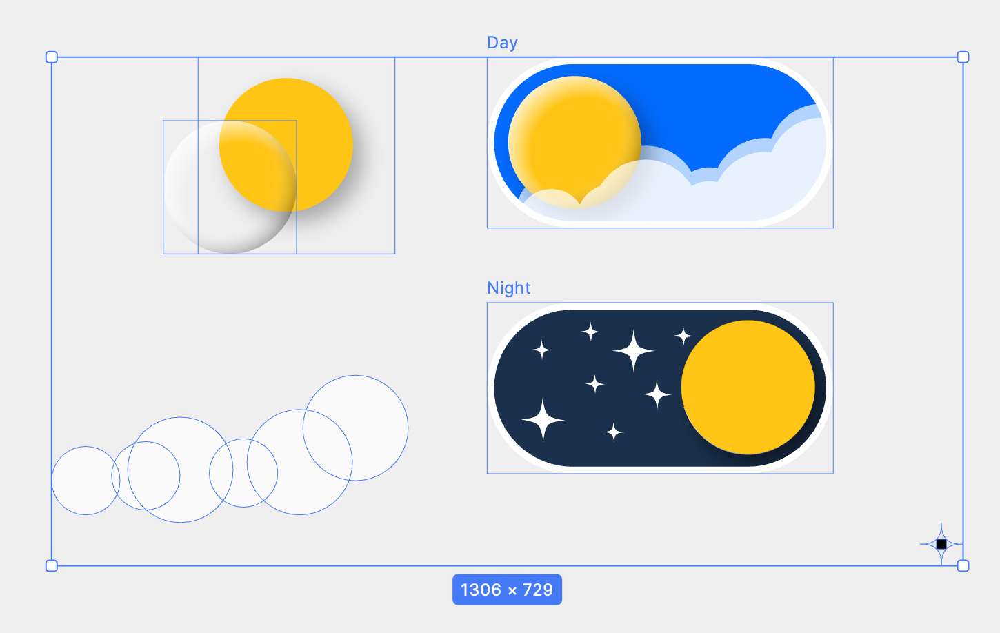

# MagicDayNightSwitchButton

随手照着网上看到的一个视频日夜切换按钮效果的练习作品，用到的技术是*MotionLayout*，还是想吐槽一句*MotionLayout* 这玩意 bug 真特么的多...

设计稿基于视频用 MasterGo 做的复盘...

### 预览视频

https://github.com/kongzue/MagicDayNightSwitchButton/assets/10115359/9fcc9389-92f3-4f9c-a9b3-601507a8ed7b

没啥复杂的，就一堆图层，还用的固定坐标，随手练习作品我没动力搞全，想当伸手党的自己去改，我代码都开源了...
